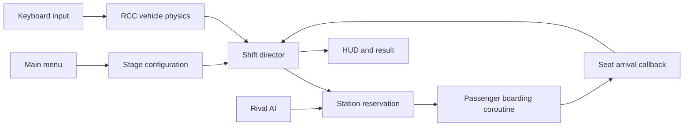
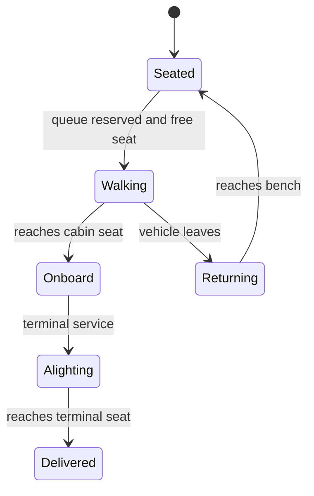
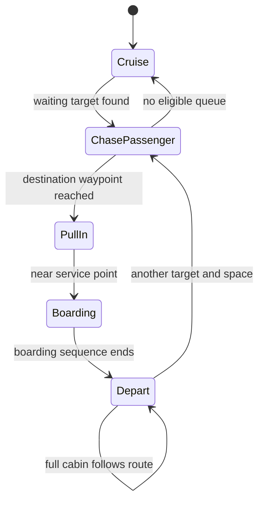

# Current system diagrams

## Gameplay communication

```mermaid
flowchart LR
 Menu[Main menu] --> Challenge[Stage configuration]
 Challenge --> Director[Shift director]
 Director --> Station[Station reservation]
 Station --> Passenger[Passenger boarding coroutine]
 Passenger --> Callback[Seat arrival callback]
 Callback --> Director
 Director --> HUD[HUD and result]
 Input[Keyboard input] --> RCC[RCC vehicle physics]
 RCC --> Director
 Rival[Rival AI] --> Station
```

## Passenger transitions

```mermaid
stateDiagram-v2
 [*] --> Seated
 Seated --> Walking: queue reserved and free seat
 Walking --> Onboard: reaches cabin seat
 Walking --> Returning: vehicle leaves
 Returning --> Seated: reaches bench
 Onboard --> Alighting: terminal service
 Alighting --> Delivered: reaches terminal seat
```

## Rival transitions

```mermaid
stateDiagram-v2
 [*] --> Cruise
 Cruise --> ChasePassenger: waiting target found
 ChasePassenger --> PullIn: destination waypoint reached
 PullIn --> Boarding: near service point
 Boarding --> Depart: boarding sequence ends
 Depart --> ChasePassenger: another target and space
 Depart --> Depart: full cabin follows route
 ChasePassenger --> Cruise: no eligible queue
```
